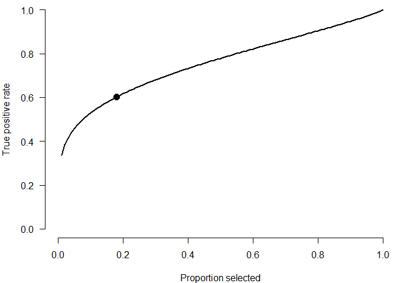
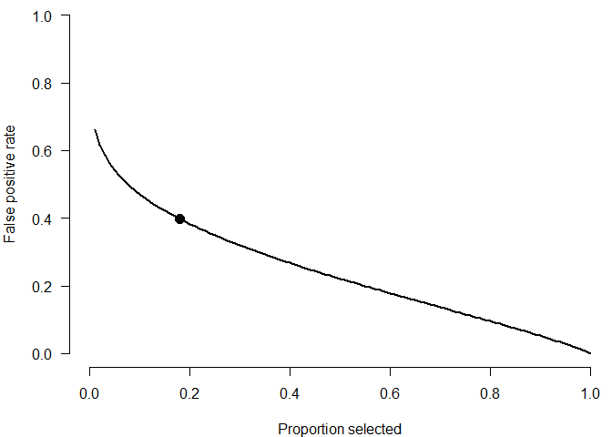
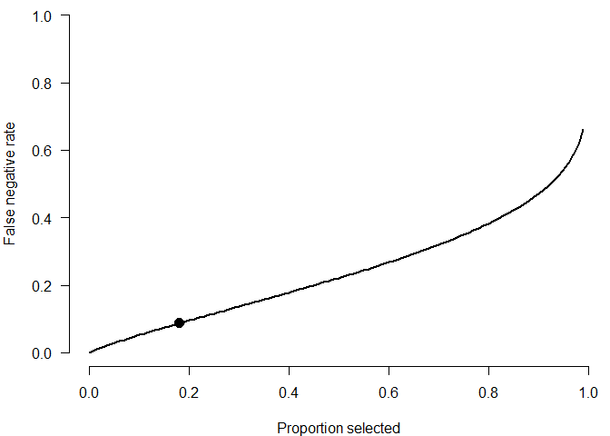

<!-- README.md is generated from README.Rmd. Please edit that file -->

# IRR2FPR

This package implements a Shiny Item Analysis module for computing
binary classification metrics from inter-rater reliability based on
Bartoš & Martinková (2024).

## Installation

You can install the development version of `IRR2FPR` like so:

``` r
devtools::install_github("FBartos/IRR2FPR")
```

## Example

The module can be used interactively via the Shiny Item Analysis:

``` r
library(ShinyItemAnalysis)
library(IRR2FPR)
run_app()
```

Furthermore, the functions can be also accessed directly from R. For
example, we use the results reported in Erosheva et. al (2021) to
compute the binary classification metrics:

``` r
library(IRR2FPR)
# use results based on Erosheva et. al (2021)
IRR      <- spearman_brown_formula(0.34, 2.79)
prop_sel <- 0.18

# compute the binary classification metrics
compute_true_positive_rate(IRR, prop_sel)
#> [1] 0.6027441
compute_false_positive_rate(IRR, prop_sel)
#> [1] 0.3972559
compute_false_negative_rate(IRR, prop_sel)
#> [1] 0.08720251
```

and visualize the metrics across the range of possible proportions of
selected candidates.

``` r
par(mar=c(4,4,0.1, 0.1))
plot(NA, type = "n", axes = TRUE, bty = "n", xlab = "Proportion selected", ylab = "True positive rate", xlim = c(0, 1), ylim = c(0, 1), las = 1)
x_seq <- seq(0, 1, 0.01)

lines(x_seq, compute_true_positive_rate(IRR = IRR, proportion_selected = x_seq), lwd = 2)
points(prop_sel, compute_true_positive_rate(IRR = IRR, proportion_selected = prop_sel), pch = 16, cex = 1.5)
```



``` r
par(mar=c(4,4,0.1, 0.1))
plot(NA, type = "n", axes = TRUE, bty = "n", xlab = "Proportion selected", ylab = "False positive rate", xlim = c(0, 1), ylim = c(0, 1), las = 1)
x_seq <- seq(0, 1, 0.01)

lines(x_seq, compute_false_positive_rate(IRR = IRR, proportion_selected = x_seq), lwd = 2)
points(prop_sel, compute_false_positive_rate(IRR = IRR, proportion_selected = prop_sel), pch = 16, cex = 1.5)
```



``` r
par(mar=c(4,4,0.1, 0.1))
plot(NA, type = "n", axes = TRUE, bty = "n", xlab = "Proportion selected", ylab = "False negative rate", xlim = c(0, 1), ylim = c(0, 1), las = 1)
x_seq <- seq(0, 1, 0.01)

lines(x_seq, compute_false_negative_rate(IRR = IRR, proportion_selected = x_seq), lwd = 2)
points(prop_sel, compute_false_negative_rate(IRR = IRR, proportion_selected = prop_sel), pch = 16, cex = 1.5)
```



## References

Bartoš, F., & Martinková, P. (2024). Selecting applicants based on
multiple ratings: Using binary classification framework as an
alternative to inter-rater reliability. British Journal of Mathematical
and Statistical Psychology. (<https://doi.org/10.1111/bmsp.12343>)

Erosheva, E. A., Martinková, P., & Lee, C. J. (2021). When zero may not
be zero: A cautionary note on the use of inter-rater reliability in
evaluating grant peer review. Journal of the Royal Statistical Society
Series A: Statistics in Society, 184(3), 904-919.
(<https://doi.org/10.1111/rssa.12681>)
